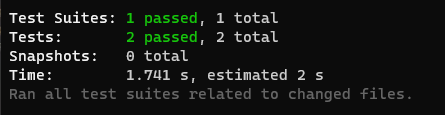
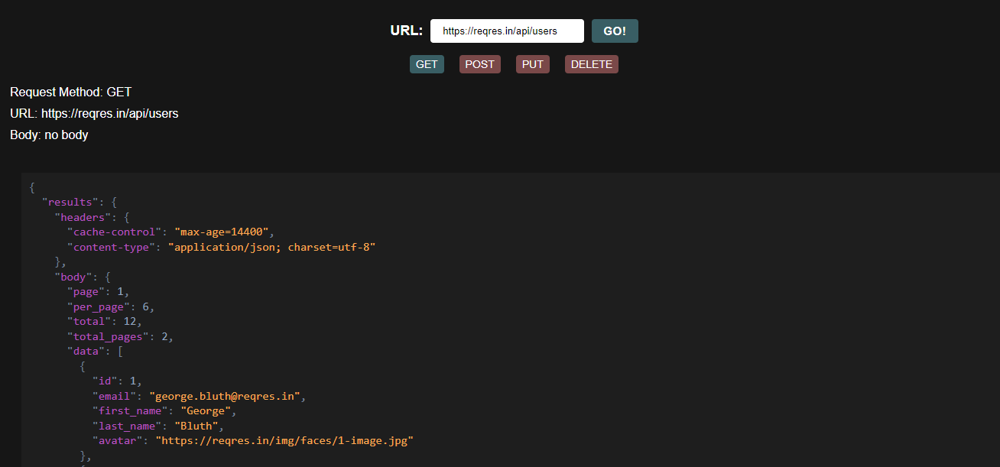
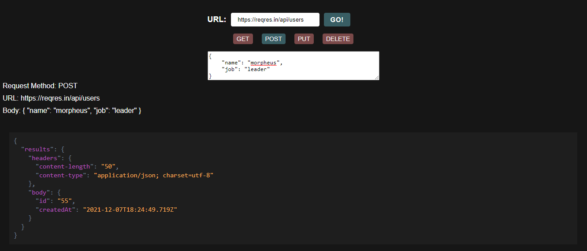
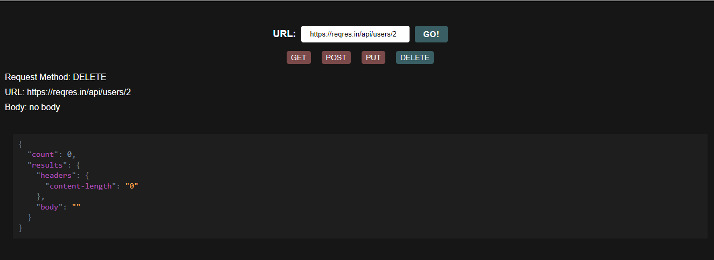

# RESTy

## Introduction

RESTy is an API testing tool that can be run in any browser, allowing a user to easily interact with APIs in a familiar interface.

### Phase 1 <-Lab26-> - Application Setup

The goal was to setup the basic scaffolding of the application, with intent being to add more functionality to the system as we go. This initial build sets up the file structure so that we can progressively build this application in a scalable manner.

#### Core application functionality ia as following:

1. The `<Form>` component should call a function on submit that updates the `<App/>` component via a function sent down as a prop so that the app can process the form values.
2. The `<Results/>` component should show mock API results.

#### Done:

1. converting all the `<App/>` components from classes to functional components > more stable and high performing.
2. styling the components using `.scss`.

#### UML

#### Sandbox

[Here](https://codesandbox.io/s/funny-darwin-pub7h?file=/src/App.js)

### Phase 2 <-Lab26-> - The useState() Hook

The goal was to receive user input in preparation of connecting to live APIs, using the useState() hook in our functional components.

### Tests

### GitHub pages link

[Here](https://hasnaa38.github.io/resty/)

### Phase 3 <-Lab26-> - The useEffect() Hook

The goal was to connect RESTy with actual APIs, running live requests.

### Application Flow

1. User enters an API URL
2. Chooses a REST Method (GET, POST, PUT, DELETE) and provides a body if needed
3. Clicks the “Go” button
4. Application fetches data from the URL given, with the method specified
5. Displays the response headers and results separately in JSON format

### GitHub pages link

[Here](https://hasnaa38.github.io/resty/)

I have been using this API for testing: [anapioficeandfire](https://anapioficeandfire.com/api/houses) and this to test other REST methods: [reqres](https://reqres.in/)

Some results:

