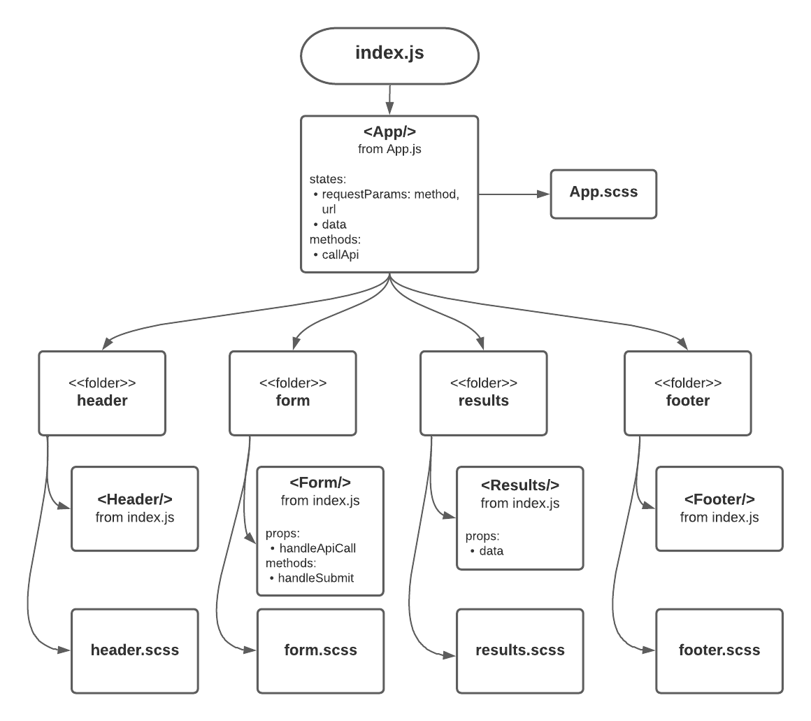

# RESTy

## Introduction

RESTy is an API testing tool that can be run in any browser, allowing a user to easily interact with APIs in a familiar interface.

### Phase 1 <-Lab26-> - Application Setup

The goal was to setup the basic scaffolding of the application, with intent being to add more functionality to the system as we go. This initial build sets up the file structure so that we can progressively build this application in a scalable manner.

#### Core application functionality ia as following:

1. The `<Form>` component should call a function on submit that updates the `<App/>` component via a function sent down as a prop so that the app can process the form values.
2. The `<Results/>` component should show mock API results.

#### Done:

1. converting all the `<App/>` components from classes to functional components > more stable and high performing.
2. styling the components using `.scss`.

#### UML

#### Sandbox

[Here](https://codesandbox.io/s/funny-darwin-pub7h?file=/src/App.js)
